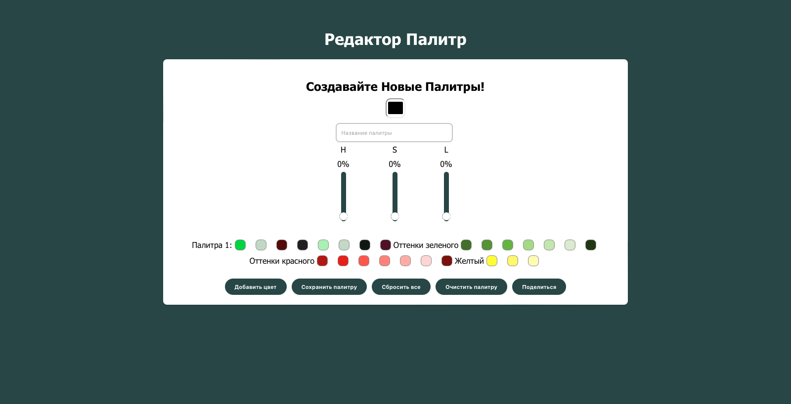

# Color Palette Explorer

This project is a tool for creating color palettes.
It was developed using the React framework, along with HTML, CSS, and JavaScript

## Installation and Setup Instructions
Clone down this repository. You will need node and npm installed globally on your machine.

Installation:

#### npm install

To Run Test Suite:

#### npm test

To Start Server:

#### npm start

To Visit App:

#### http://localhost:3000

## App Screenshots

## How to use the project? 

#### Adding colors to a palette

Use the sliders for hue, saturation, and lightness to choose colors, or click the color square to select from predefined colors. After selecting a color, click the "Add Color" button.

#### Saving palettes

Once you've added colors to your palette, you can give it a name or it will be assigned a default name. Click the "Save" button to save the palette. Palettes are saved locally in the browser's storage.

#### Deleting palettes

To delete all saved palettes, click the "Delete Palettes" button.

#### Clearing the current palette

To remove all colors from the current palette, click the "Clear Palette" button.

#### Sharing palettes

Click the "Share" button to copy the names and color codes of all palettes. 
You can then share this information with your friends!

## Reflection

It took me approximately four days to complete this project. Crafting the HTML and CSS files was relatively straightforward, but I encountered challenges when writing the JavaScript code. Developing this app provided me with valuable insights into color theory and manipulation.

Through this project, I deepened my understanding of how colors work and their significance in design. I learned various techniques for selecting and manipulating colors programmatically, which enhanced my skill set as a developer.

I was thinking how to share colors with other users and came up with an idea
that users may get copy of names and colors of palettes and send it.

Overall, despite the initial challenges, this project was a rewarding learning experience that allowed me to expand my knowledge and skills in web development.